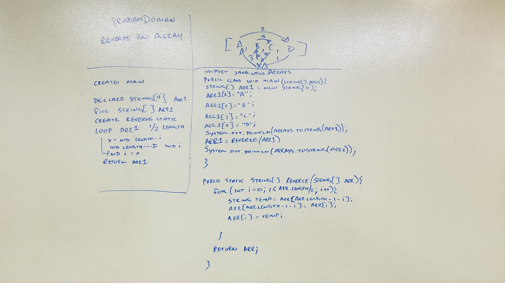

#Data Structures and Algorithms Problems:

##November 26th: Reverse an array.

### Challenge
Reverse an array.

### Approach & Efficiency
Uses a method built to reverse string arrays. This method works by looping half way through the array reversing it by swapping indexes based on the value of "i"

This approach is Big O(1) for space and O(log n) for time because it creates space for the array and does not duplicate it in the process of manipulating it.
It also only loops half of the length. Where n is the size of the array and time it takes to iterate over the entire array.

### Solution
Inline-style:
