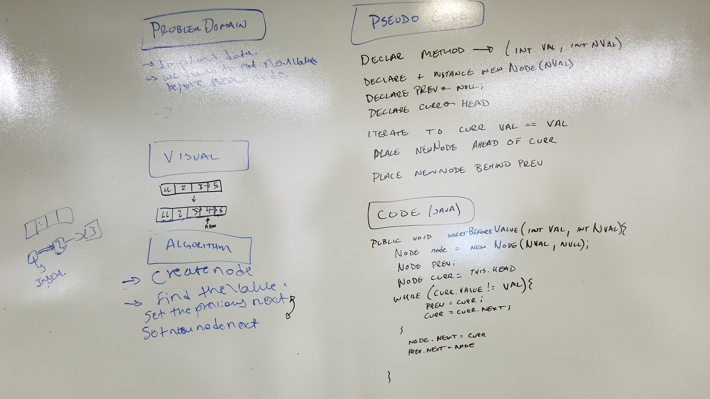
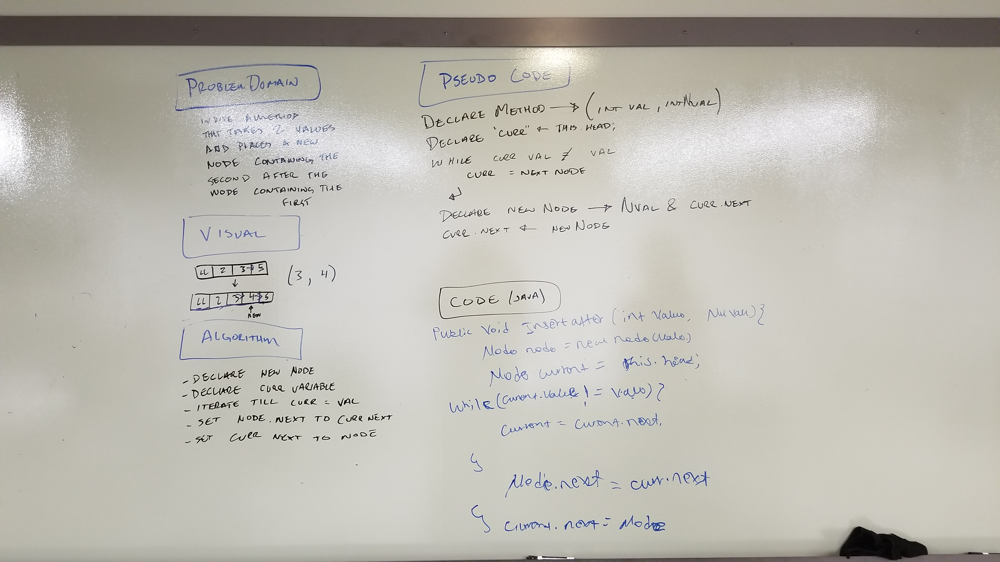

#Data Structures and Algorithms Problems:

##November 26th: Reverse an array.

### Challenge
Reverse an array.

### Approach & Efficiency
Uses a method built to reverse string arrays. This method works by looping half way through the array reversing it by swapping indexes based on the value of "i"

This approach is Big O(1) for space and O(log n) for time because it creates space for the array and does not duplicate it in the process of manipulating it.
It also only loops half of the length. Where n is the size of the array and time it takes to iterate over the entire array.

### Solution

##November 27th: Add a number to an array.

### Challenge
Add a number to an array.

### Approach & Efficiency
Uses a method to insert a number into an array in the numerical position.

This approach is Big O(n) for space and O(n) for time because it creates a duplicate array containing the values and iterates through the entire array one time.

### Solution

##November 28th: Binary Search of an Array.

### Challenge
Binary Search of an Array

### Approach & Efficiency
After reading up on Binary Search at on wikipedia (src: https://en.wikipedia.org/wiki/Binary_search_algorithm) I decided to rebuild the algorithm in from C to Java.

This approach is Big O(1) for space and O(log n)
It does not create a duplicate of the array and only uses minor space increases to store temporary integers in the search process
The time used can be calculated on a logarithmic curve.

### Solution

##December 3rd: Linked Lists.

### Challenge
Implement a Linked List with 3 methods: insert, includes, and print

### Approach & Efficiency
Linked Lists insert nodes at the head in O(1) time with O(n) space
Searching the Linked List is O(n) time with O(1) space
Printing the Linked List is O(n) time with O(1) space

The insertion of a node first checks to see if a node exists at head.
If head exists it creates a node and places the previous head node as that nodes next, then replaces the head.
If no head exists it simply creates a node and makes it the head.

Searching starts at the head then checks the value of the node before setting the current node to the next node.
If it finds a value matching the requested value it returns true, otherwise it returns false when it reaches the end of the list.

Printing the list starts at the head and sends the value of the node to the system out before setting the current node to the next node and repeating till the end.

##December 4rd: Linked Lists.

### Challenge
Implement a Linked List methods to append at the end, insert before node with a value, insert after a node with value.

### Approach & Efficiency
Linked Lists append nodes at the head in O(n) time with O(1) space
Inserting Before a Value is O(n) time with O(1) space
Inserting After a Value is O(n) time with O(1) space

Append first checks to see if head is null, it then iterates to the end of the list stopping on the last node and placing a new node of a given value after it.

InsertBeforeValue iterates through the list stopping on the first node with a given value. While doing this it keeps track of the previous node and current node.
It then places the new node between the previous node and the node found with the value requested.

InsertAfterValue iterates through the list stopping on the first node with a given value. It then places the new node between the node found and the next node.

### Solution

