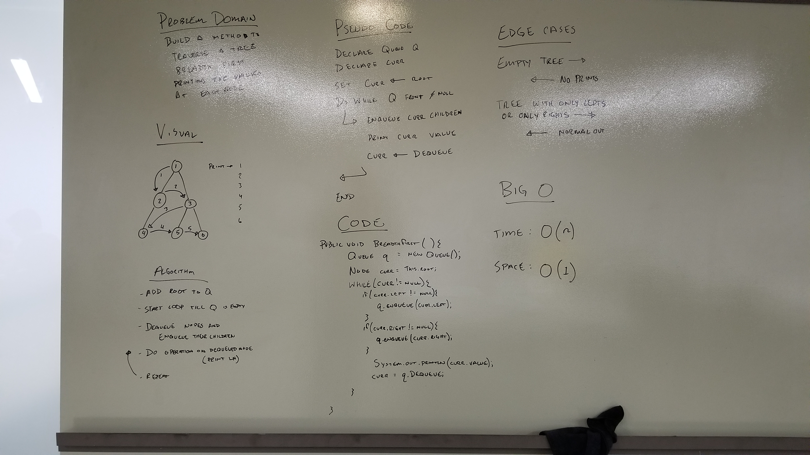

## December 19th: Breadth First Traversal

### Challenge
Implement a method that takes in a tree and traverses that tree breadth first printing each nodes value. Breadth first means that it searches each layer of the tree completely before moving to the next.

### Approach & Efficiency

-> [Code](../src/main/java/tree/TreeBreadthTraversal.java) <- -> [Testing](../src/test/java/tree/TreeBreadthTraversalTest.java) <-

The first step is to declare a new Queue of Nodes. This will allow us to keep track of what needs to be traversed and the order.

    Queue<Node> q = new Queue<>();

Next we declare a current (curr) node and set it equal to the root. This node is used as a conditional for the while loop and to track the current node being manipulated or in this case printed.

    Node n = t.root;

After both the variables are declared we start looping while the curr node is not null. During this loop the first thing we do is enqueue the children of the curr node if they exist. We then print the curr nodes value and set the curr node to the next node in the queue. This will continue till the end of the tree because every time the loop begins the available children of the curr node are placed in the queue ensuring that as long as the bottom of the tree hasn't been reached the queue will never run out of nodes.

    while (n != null) {
        if (n.left != null) q.enqueue(n.left);
        if (n.right != null) q.enqueue(n.right);
        System.out.println(n.value);
        n = q.peek() == null? null : (Node)q.dequeue().value;
    }

This solution is Big O(1) for space as it doesn't use any additional memory and Big O(n) for time since it loops through the entire list once.

### Solution

