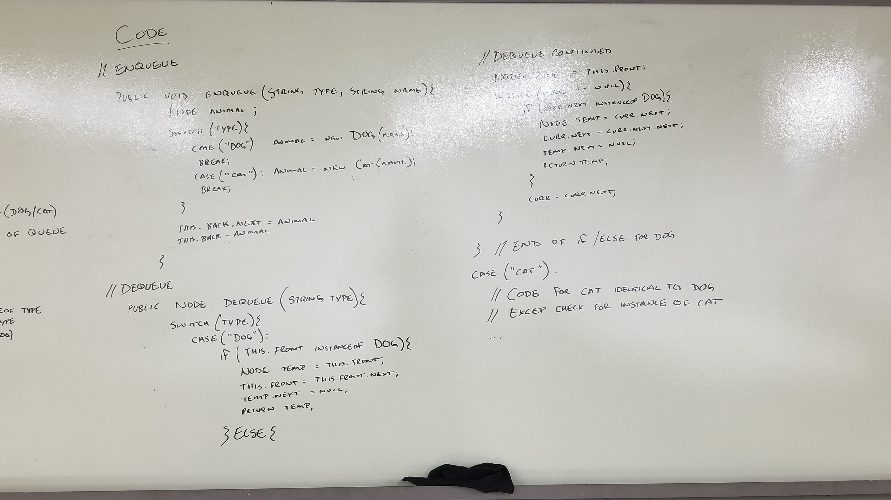

## -FIFO Animal Shelter-

### Challenge
Create a FIFO Animal shelter where a type of animal can be specified and the first of that type is returned.

### Approach & Efficiency

* #### Enqueue
    This method takes in a type of animal, either "dog" or "cat", and a name of that animal creating a new instance of the animal type and adding it to the back of the queue

    _**Enqueue is O(1) Time and O(n) Space.**_

* #### Dequeue
    This method takes in a type of animal, if the type is "dog" or "cat", it checks the front of the queue to see if it is an instance of that type of animal. If the front is that type of animal it returns the front after setting the front to the next node to remove it. Otherwise it goes through the entire queue one node at a time to find the first instance of the type of animal

    _**Dequeue is O(n) Time and O(n) Space.**_

* #### Solution

    

    
