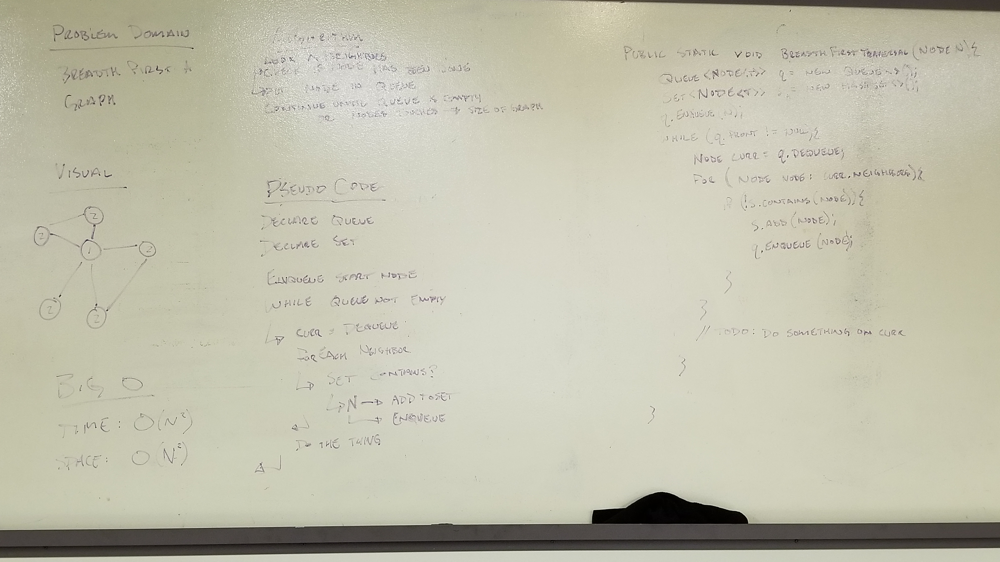
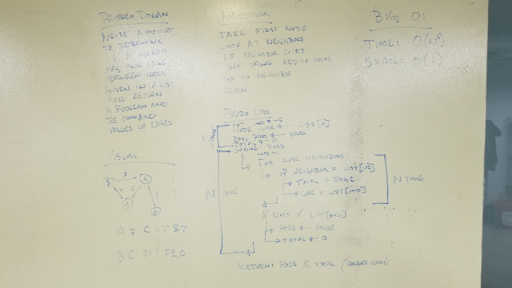

## January 7th 2019: Graphs.

[code](../src/main/java/graph/Graph.java)
[test](../src/test/java/graph/GraphTest.java)

### Challenge:

Implement a graph. The graph should have access to adding Vertices (Nodes) and Edges (Connections between nodes). The graph should also have a method to get all Vertices in the graph, get all Neighbors of a specific Vertex, and get the size of the graph (Number of Vertices)

### Approach and Efficiency:

The graph implemented contains two private classes for Vertex and Edges:

#### Vertex
The Vertex class contains information on data and neighbors connected to it. The data is a generic type of T while the neighbors is a set of edges.

#### Edge
The Edge class contains the vertex it points to and the weight of the connection. The weight is stored as a double.

The graph also contains the following methods:

#### Add Vertex (addVertex)
This adds a vertex to the graph by creating a new vertex and storing it in the set of vertex present on the graph instance. It takes in data and uses this to create the new vertex

This method is O(1) for Time and Space

#### Add Edge (addEdge)
This method takes in two vertex and adds an edge between the two of them. It does this by creating an edge pointing to each vertex and adding them to the neighbors of the other vertex. This method is overloaded, one takes a weight and the other doesn't. The weight when not provided defaults to 1.0.

This method is O(1) for Time and Space

#### Get Vertices (getVertices)
This method returns the set of vertex present on the instance of the graph.

This method is O(1) for Time and Space

#### Get Neighbors (getNeighbors)
This method takes in a vertex, finds that vertex and returns the set of neighbors on that vertex instance.

This method is O(1) for Time and Space

#### Size (size)
This method returns the size of the set of vertex present on the instance of the graph.

This method is O(1) for Time and Space

#### Breadth First (breadthFirst)
This method takes in a vertex then traverses the tree outward from there. First it enqueues the provided node then it adds it to an arraylist to track what has been seen.
It then starts a loop that will run until the Queue is empty, inside this loop it first sets the current vertex by dequeueing the first vertex in the queue. It then loops through the neighbors of the current vertex and checks if they have been seen, if not it places them in the list and enqueues them. It continues till all vertex that are attached to the provided vertex have been seen and the queue empties. Any vertex in the graph not connected to the provided vertex are never traversed.

This method is O(N2) for Time and O(N) Space

#### Get Edges (getEdges)
This method takes in an arraylist of vertex, it then starts at the first vertex and determines whether there is a path from one vertex to the next through the entire list, and calculates the "cost" of the edges for each hop as a total. It does this by keeping a running total and boolean to track whether the connections exist and what the total is.

This method is O(N2) Time and O(1) Space

