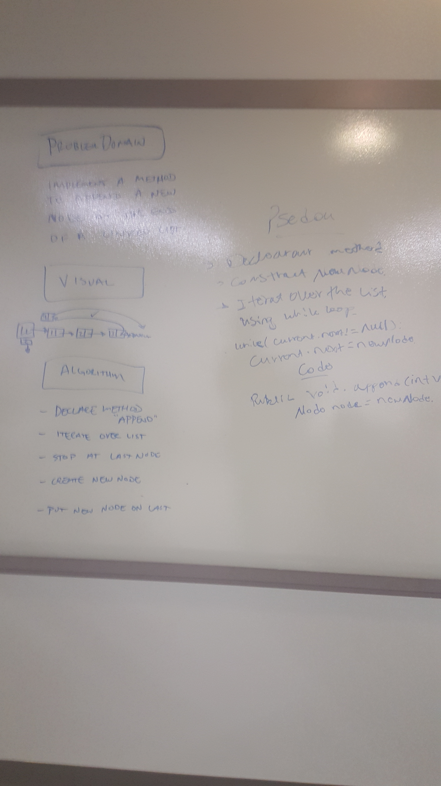
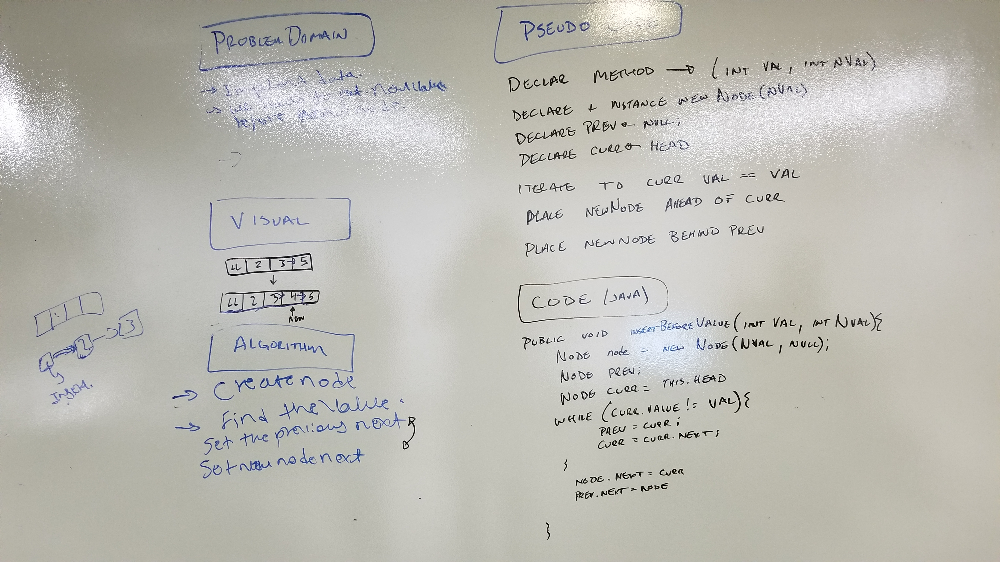
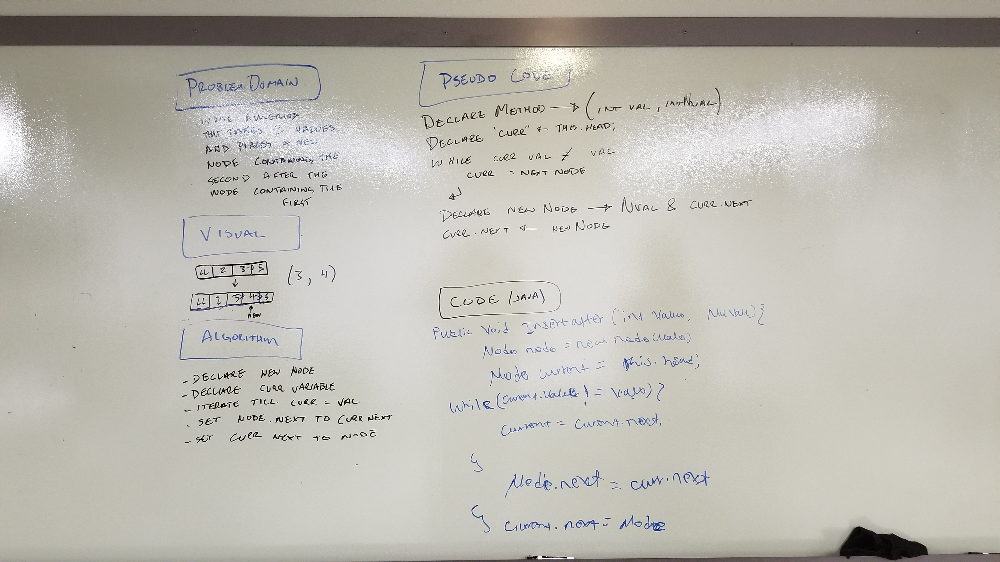
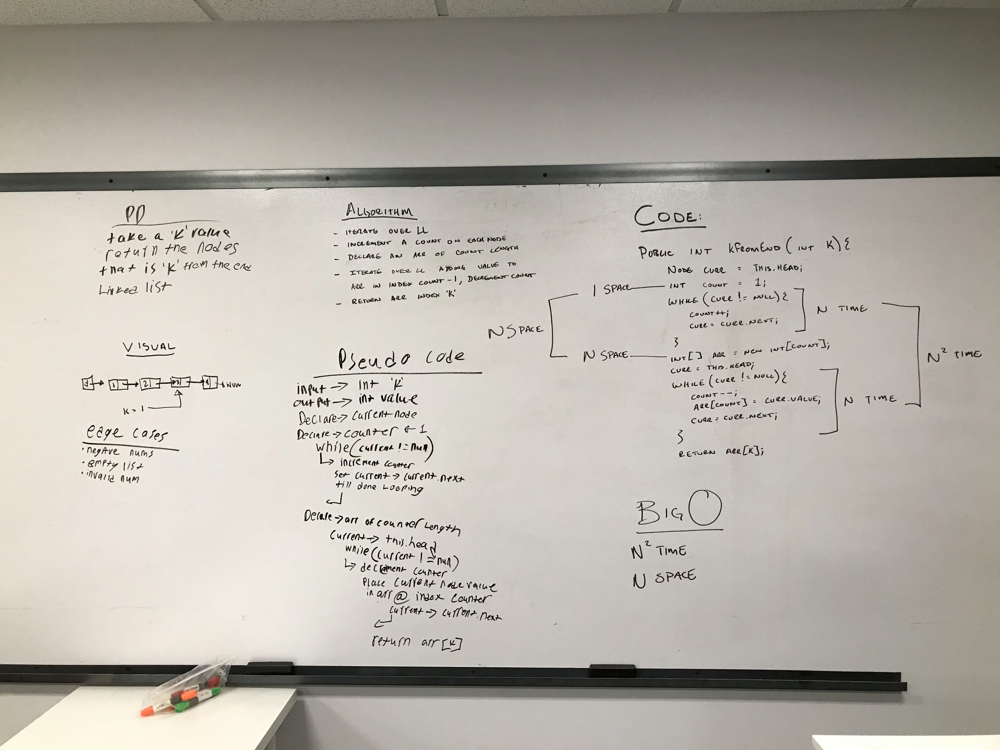
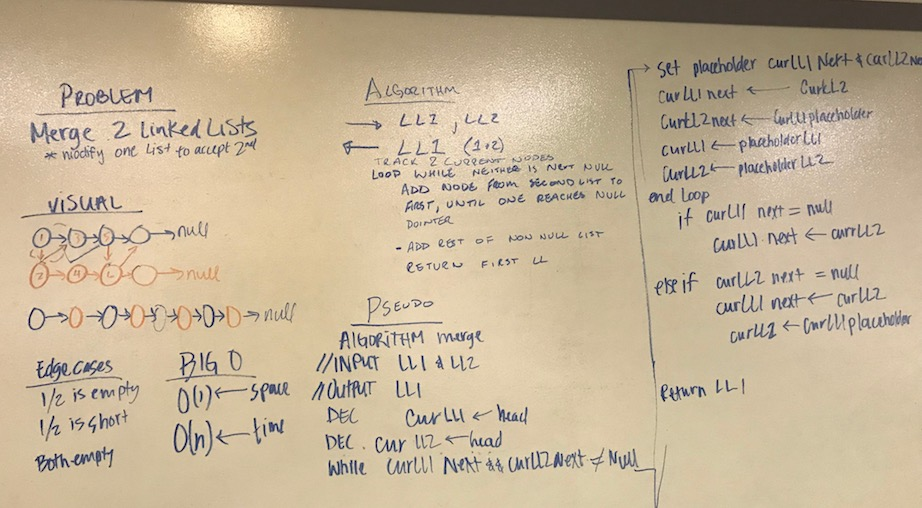
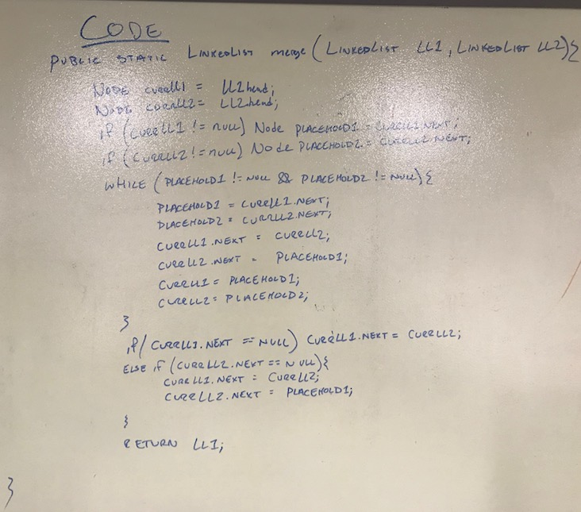

## December 3rd: Linked Lists.

### Challenge
Implement a Linked List with 3 methods: insert, includes, and print

### Approach & Efficiency
Linked Lists insert nodes at the head in O(1) time with O(n) space
Searching the Linked List is O(n) time with O(1) space
Printing the Linked List is O(n) time with O(1) space

The insertion of a node first checks to see if a node exists at head.
If head exists it creates a node and places the previous head node as that nodes next, then replaces the head.
If no head exists it simply creates a node and makes it the head.

Searching starts at the head then checks the value of the node before setting the current node to the next node.
If it finds a value matching the requested value it returns true, otherwise it returns false when it reaches the end of the list.

Printing the list starts at the head and sends the value of the node to the system out before setting the current node to the next node and repeating till the end.

## December 4rd: Linked Lists.

### Challenge
Implement a Linked List methods to append at the end, insert before node with a value, insert after a node with value.

### Approach & Efficiency
Linked Lists append nodes at the head in O(n) time with O(1) space
Inserting Before a Value is O(n) time with O(1) space
Inserting After a Value is O(n) time with O(1) space

Append first checks to see if head is null, it then iterates to the end of the list stopping on the last node and placing a new node of a given value after it.

InsertBefore iterates through the list stopping on the first node with a given value. While doing this it keeps track of the previous node and current node.
It then places the new node between the previous node and the node found with the value requested.

InsertAfter iterates through the list stopping on the first node with a given value. It then places the new node between the node found and the next node.

### Solution

## December 5th: Linked List K From End.

### Challenge
Implement a method that will find a value of a node K places from the end of the linked list.

### Approach & Efficiency
First the method iterates over the linked list counting the number of nodes
then it creates an array of that count in length
then it iterates over the linked list putting the values into the array starting at the end. it does this by using the count and decrementing it as it goes.
then it returns the value at index k of the array containing the values backward.

This approach is Big O(n^2) for Time and Big O(n) for Space. 
It could be optimized by removing the array and subtracting k from count then finding the node when count = 0 the second time through. 
This was discovered mid whiteboard but we went with the original design

### Solution

## December 6th: Linked List Merge.

### Challenge
Implement a method that will take two Linked Lists and combines them into one linked list.

### Approach & Efficiency
Takes two Linked Lists takes zipper merges them placing each node from the second linked list after the corresponding node from the first linked list. 

### Solution

