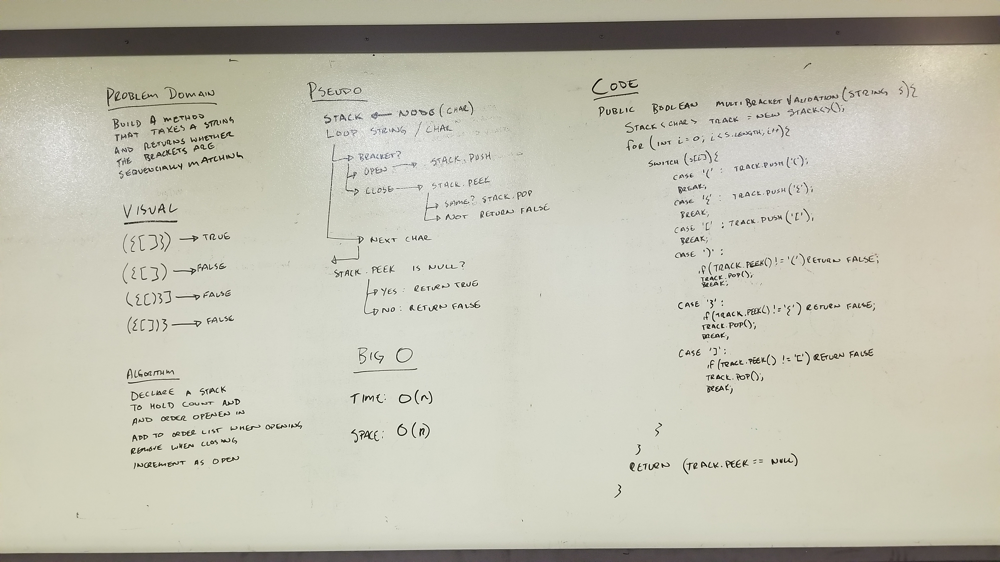

## Multi Bracket Validation

### Challenge
Build a method that takes in a string and returns a boolean value to represent whether brackets are sequentially matching.

### Approach & Efficiency
Using a stack to keep track of order and number of open sets of brackets. When a bracket is closed first check the stack top for a matching open bracket, if they are the same remove it from the stack.

Big O for Time is O(n)

Big O for Space is O(n)

### Solution

