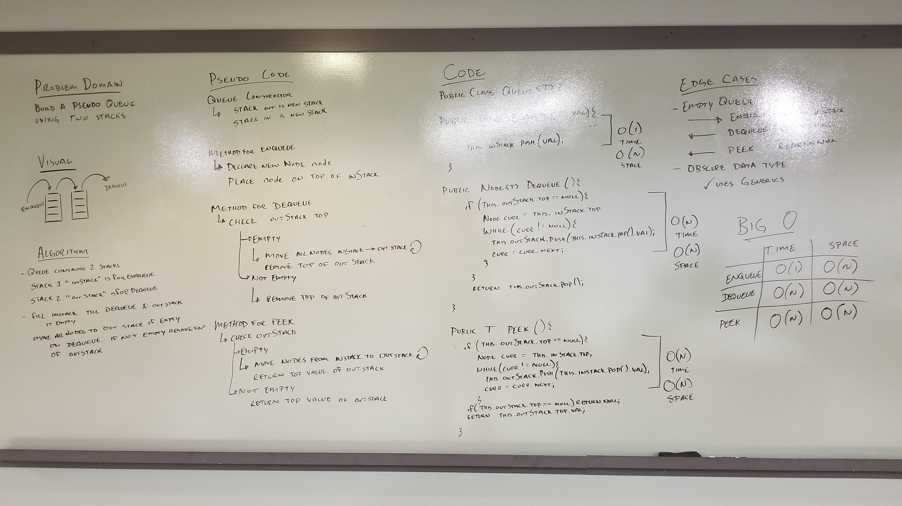

## -Queue With Stacks-

### Challenge
Implement Queue using two Stacks with 3 methods: Enqueue and Dequeue

### Approach & Efficiency

* #### Enqueue
    This method takes a value of generic type and adds it to the queue by pushing it into the input stack (inStack).

    _**Enqueue is O(1) Time and O(n) Space.**_

* #### Dequeue
    This method checks to see if the output stack (outStack) is empty and if it is dumps the input stack (inStack) into the output. After checking and completing the cycle of in to out it then pops the top of the output stack.

    _**Dequeue is O(n) Time and O(n) Space.**_

* #### Peek
    This method checks to see if the output stack (outStack) is empty and if it is dumps the input stack (inStack) into the output. After checking and completing the cycle of in to out it returns the value of the top node in the output stack without removing it.

    _**Peek is O(n) Time and O(n) Space.**_
    
* #### Solution

    
